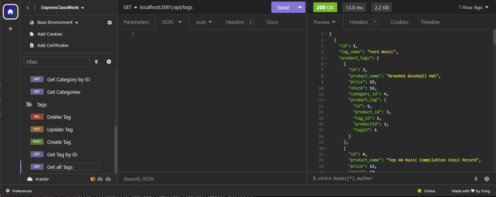
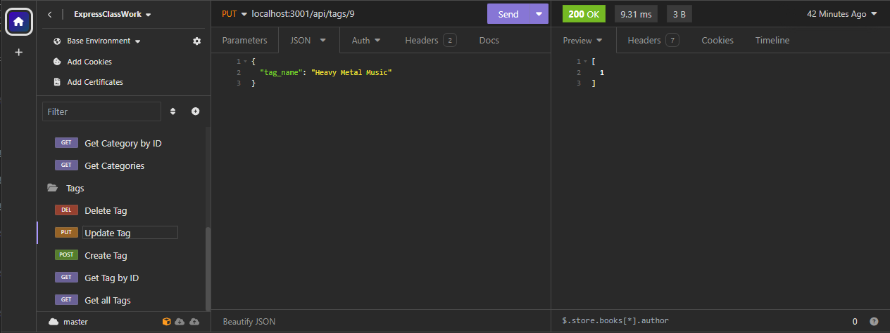
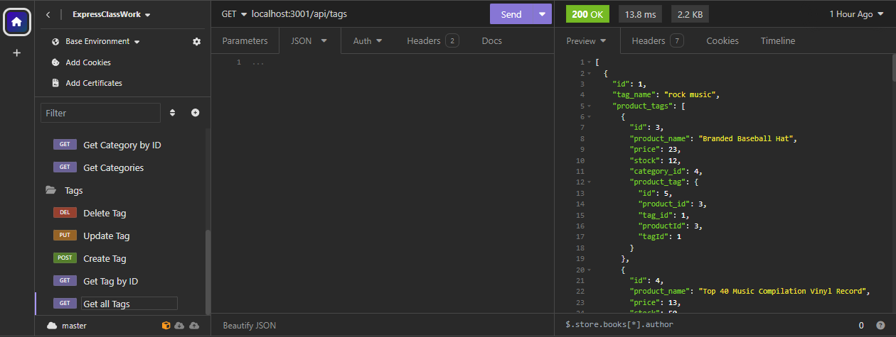

# E-Commerce-Backend

## Video Link
[Video](https://drive.google.com/file/d/1z8boLagxLeGc7qonW4r401IdQ6iYOYSN/view)

## Description
    - As a developer I wanted to be able to create a backend for an e-commerce website.
    - This project was built to allow a business manager to view, update, create or delete products categories or tags for their businesses databases
    - This project was able to solve how to use sequalize to interact with a MySQL database
    - This project allowed me to learn how to create and seed a sql database more effectively. I also learned how to built sequalize models for the databases. I alsoe leared how to efficitvely use routing functions to direct the api calls, and to have them execute functions based on those calls. 
    

## Installation
    To install this follow the link to the github repository below.
[E-Commerce Backend](https://github.com/Neglon/E-Commerce-Backend)
Clone the files to you pc. Using VSCode, open the terminal, in gitbash, navigate to the folder holding all the cloned files and run `npm i`
Once those have been installed navigate into the db folder. enter `mysql -u "your username" - p` Then enter your password to enter mysql. Run `source schema.sql;` to set up the database. Now navigate to the main directory and run `node seeds/index.js` to seed the database. Create a .env file and paste the below into it, but add your username and password.
```
DB_NAME='ecommerce_db'
DB_USER=''
DB_PW=''
```

Finally in the terminal to run `npm start` to start the app.


## Usage
    Once the the server islistening you will be able to use insomnia to make api get, post, put, and delete calls based on the route you are inputing. Watch the video for examples of JSON body inputs for post and put calls.


   




## Credits
    N/A

## Liscence
    N/A

## Code Source
    Backend Code fully written by Thomas Neylon, references were made to previous classwork, and the websites below. Starter code was provided by the school.
    
[Sequalize Documentation](https://sequelize.org/docs/v6/core-concepts/model-basics/)
   
[Stack overflow Sequalize mutiple tables](https://stackoverflow.com/questions/60121647/select-from-multiple-tables-in-sequelize)


